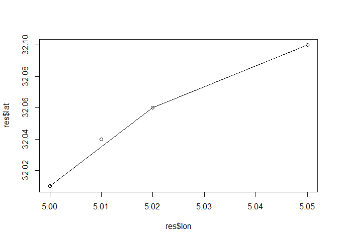

<!-- README.md is generated from README.Rmd. Please edit that file -->

# topdowntimeratio

<!-- badges: start -->

<!-- badges: end -->

The goal of topdowntimeratio is to condense sequences of longitudinal
GPS data into segments for ease of processing. The method used in this
package is as outlined in Meratnia and Rolf (2004).

## Installation

When it’s released (it isn’t yet), you can install the released version
of TopDownTimeRatio from [CRAN](https://CRAN.R-project.org) with:

``` r
install.packages("topdowntimeratio")
```

And the development version from [GitHub](https://github.com/) with:

``` r
# install.packages("devtools")
devtools::install_github("daniellemccool/topdowntimeratio")
```

## Example

Basic usage requires that your data has at least longitude and latitude
coordinates as well as a timestamp. You can provide the names if they
differ from lon, lat and timestamp.

Here we generate a single segment

``` r
library(topdowntimeratio)
df <- data.frame(lon = c(5, 5.01, 5.02, 5.05),
                 lat = c(32.01, 32.04, 32.06, 32.10),
                 timestamp = c(500, 600, 800, 2000))

res <- tdtr(df, n_segs = 1)

print(res)
#>     lon   lat timestamp timestamp_numeric segment_start segment_end
#> 1: 5.00 32.01       500               500          TRUE       FALSE
#> 2: 5.01 32.04       600               600         FALSE       FALSE
#> 3: 5.02 32.06       800               800         FALSE       FALSE
#> 4: 5.05 32.10      2000              2000         FALSE        TRUE
#>    adjusted_lat adjusted_lon segment_id seg_start_lat seg_start_lon
#> 1:       32.010     5.000000          1         32.01             5
#> 2:       32.016     5.003333          1         32.01             5
#> 3:       32.028     5.010000          1         32.01             5
#> 4:       32.100     5.050000          1         32.01             5
#>    seg_start_time seg_end_lat seg_end_lon seg_end_time seg_dur seg_dist_lat
#> 1:            500        32.1        5.05         2000    1500         0.09
#> 2:            500        32.1        5.05         2000    1500         0.09
#> 3:            500        32.1        5.05         2000    1500         0.09
#> 4:            500        32.1        5.05         2000    1500         0.09
#>    seg_dist_lon perc_of_seg_dur     dist
#> 1:         0.05      0.00000000    0.000
#> 2:         0.05      0.06666667 2740.110
#> 3:         0.05      0.20000000 3678.874
#> 4:         0.05      1.00000000    0.000
```

Plot example, initial segment


Plot example, new segment at greatest distance


<div id="refs" class="references">

<div id="ref-meratnia2004spatiotemporal">

Meratnia, Nirvana, and A Rolf. 2004. “Spatiotemporal Compression
Techniques for Moving Point Objects.” *International Conference on
Extending Database Technology*. Springer.

</div>

</div>
